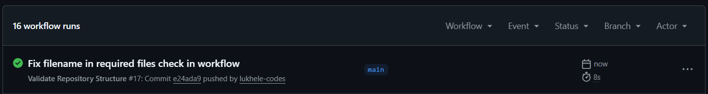

# RaceDaySystem
RaceDay is a full stack event management platform for South Africa's road running, walking, and cycling community

System Description
RaceDay is a fullstack, web-based event management platform for the South African road running, walking, and cycling community. It allows Event Organisers to create and manage events, define categories per event, capture participant results, and view enrolment rosters. Participants can browse upcoming events, enrol in a category, track their own enrolment and result history, and prepare for race day.

Entity Relationship Diagram
See docs/erd.png. The data model consists of six entities: Roles, Users, Events, Categories, Enrolments, and Results. Key design decisions:
Roles is a lookup table rather than a text column on Users, keeping role names consistent and easy to extend.
Users is a single table for both Organisers and Participants, distinguished by RoleId, to avoid duplicating shared columns.
Categories belongs to an Event (e.g. a "10km" or "21km" category within a specific race), and Participants enrol into a Category, not directly into an Event.
Enrolments links a Participant to a Category, with a UNIQUE constraint preventing duplicate enrolment in the same category.
Results has a strict 1:1 relationship with Enrolments (one result per enrolment), captured by an Organiser after race day.

API Endpoint Plan

See docs/API Endpoint Plan 6.md for the full table of endpoints covering Authentication, User Profile, Events, Categories, Event Enrolments, and Results, including HTTP method, route, role required, request body, and expected response for each.

SQL Database Script
See docs/RaceDay.sql. The script:
Creates the RaceDayDB database and all six tables matching the ERD exactly.
Defines all primary keys, foreign keys, and constraints (NOT NULL, UNIQUE, DEFAULT).
Seeds the database with realistic sample data: 2 Organisers, 2 Participants, 3 Events, 5 Categories, 4 Enrolments, and 2 Results.

**CI Screenshot:**  

**Youtube Link:**
https://youtu.be/C8BJRqQNRoI
